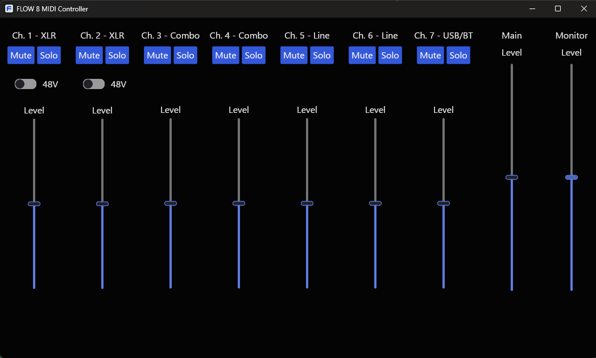

 

# FLOW 8 MIDI Controller

A simple non-official ~~cross-platform~~ (only for Windows, momentarily) desktop MIDI controller for the [Behringer FLOW 8 mixer](https://www.behringer.com/behringer/product?modelCode=0603-AEW).

Made with 🦀 [Rust](https://www.rust-lang.org/), 🧊 [iced](https://iced.rs/) and 🎹 [midir](https://github.com/Boddlnagg/midir).

## Download

Download the most recent version [here](https://github.com/abelroes/flow-8-midi/releases).

## Features

- All channels Level, Mute and Solo commands.
- Level commands for Main and Monitor busses.

## How to Use

1. Download the FLOW 8 MIDI Controller.
2. Connect your FLOW 8 device to your PC.
3. Open the application.
4. Use the GUI to control the parameters.

## Known Issues

- Your device needs to be connected for the application to work.

## Disclaimers

- This application is not official. Any damage (to the unit or any peripherals), misuse or act that avoids warranty is not our responsibility. Use it at your own risk.
- Differently from the official bluetooth mobile app, this application can't reflect commands from the device. Meaning: if you change a fader in the mobile app, you won't see it reflected in this application.
- Only basic MIDI commands are implemented (for now - this is a work in progress).
- We do accept requests.
- Current and future implementations are limited by the [FLOW 8 MIDI Implementation](https://mediadl.musictribe.com/media/PLM/data/docs/P0DNM/QSG_BE_0603-AEW_FLOW-8_WW.pdf#page=23).
- Later, I found [another solution](https://ikarusstore.com/community/articulo-27-control-your-behringer-flow-8-via-windows-mac-controla-tu-behringer-flow-8-via-windows-y-mac) for controlling this unit. Give it a try and use what is best for you!

## License

[GNU GENERAL PUBLIC LICENSE - Version 3](./LICENSE)

## Donations

If you like to support my work, you can [buy me a
~~coffee~~ beer.](https://www.buymeacoffee.com/abelroes)

