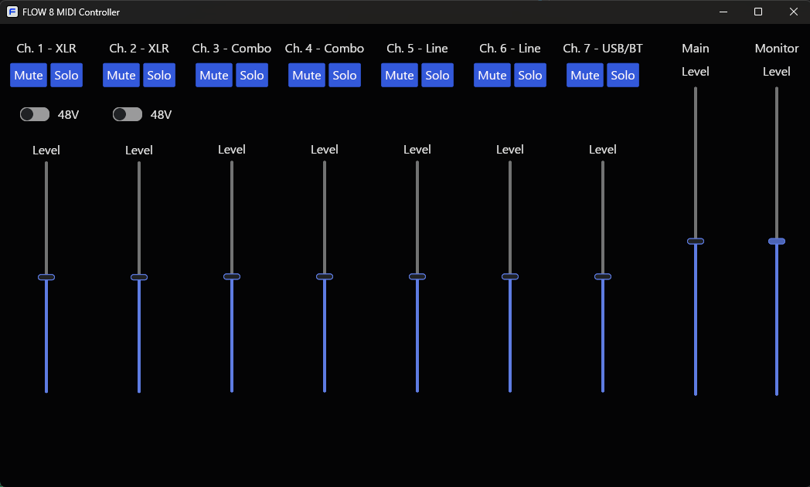

<div align="center">

<br>

# FLOW 8 MIDI Controller

A simple non-official cross-platform desktop MIDI controller for the [Behringer FLOW 8 mixer](https://www.behringer.com/behringer/product?modelCode=0603-AEW).

Made with 🦀 [Rust](https://www.rust-lang.org/), 🧊 [iced](https://iced.rs/) and 🎹 [midir](https://github.com/Boddlnagg/midir).



</div>

## About

* **Repository**: [github.com/abelroes/flow-8-midi](https://github.com/abelroes/flow-8-midi)

## Download

Pre-built binaries for **Linux** (x86\_64), **Windows** (x86\_64), and **macOS** (Apple Silicon) are available on the [Releases page](https://github.com/abelroes/flow-8-midi/releases).

## Features

* **Mixer page**: Level, Mute, Solo, Gain, Pan, Compressor, Low Cut, and 48V Phantom Power per channel. Bus Level, Pan, and Limiter for Main and Monitor buses.
* **EQ page**: 4-band EQ per channel and 9-band EQ with Limiter per bus (Main, Monitor 1, Monitor 2).
* **Sends page**: Send levels to Monitor 1, Monitor 2, FX 1, and FX 2 per channel.
* **FX page**: FX preset selection (1-16), Parameter 1 and Parameter 2 controls for both FX slots, plus FX bus return levels.
* **Snapshots page**: Load any of the 15 mixer snapshots or reset to factory defaults.
* **Settings page**: Theme selection, sync interval configuration, and debug log viewer.
* **BLE sync**: When connected via Bluetooth, reads the mixer's full state (all parameters, channel names, snapshot names) and reflects it in the UI.
* **Auto-detection**: Automatically detects the FLOW 8 on startup via USB MIDI.
* **Cross-platform**: Works on Windows, Linux, and macOS.

## How to Use

1. Download the FLOW 8 MIDI Controller.
2. Connect your FLOW 8 device via USB and power it on.
3. Open the application — the FLOW 8 is detected and connected automatically.
4. Use the page tabs (Mixer, EQ, Sends, FX, Snapshots) to control all mixer parameters.
5. **(Optional)** Connect via Bluetooth to sync the mixer's current state to the UI (see [User Manual](./docs/MANUAL.md#10-bluetooth-ble-sync)).

## 🍺 Support the Project

If you find this useful, consider [buying me a beer](https://www.buymeacoffee.com/abelroes) — it keeps the project alive!

<a href="https://www.buymeacoffee.com/abelroes" target="_blank"></a>

## Documentation

* **[User Manual](./docs/MANUAL.md)** — Setup, UI pages, BLE sync, and how everything works.
* **[FAQ — Troubleshooting](./docs/MANUAL.md#11-faq--troubleshooting)** — Common issues with Bluetooth, USB, snapshots, and more.
* **[Developer Manual](./docs/DEV_MANUAL.md)** — Dev-tools, calibration workflow, and CLI tools.
* **[MIDI Implementation Research](./docs/flow8-midi-implementation.md)** — Protocol reverse-engineering details.

## Building from source

### Prerequisites

* [Rust](https://www.rust-lang.org/tools/install) 1.85 or later

#### Linux

Install the required system dependencies:

```bash
# Debian/Ubuntu
sudo apt install libasound2-dev pkg-config libxkbcommon-dev libwayland-dev libdbus-1-dev

# Fedora
sudo dnf install alsa-lib-devel pkgconfig libxkbcommon-devel wayland-devel dbus-devel

# Arch
sudo pacman -S alsa-lib pkgconf libxkbcommon wayland dbus
```

### Build & Run

```bash
cargo run --release
```

### Lint

```bash
cargo clippy --release -- -D warnings
```

### Cross-compilation

```bash
cargo build --release --target x86_64-unknown-linux-gnu
cargo build --release --target x86_64-pc-windows-gnu
cargo build --release --target aarch64-apple-darwin
```

The binary is output to `target/<target>/release/`.

### Creating a release

Push a version tag to trigger automated builds for all platforms via GitHub Actions:

```bash
git tag v1.1.0
git push origin v1.1.0
```

This creates a GitHub Release with binaries for Linux, Windows, and macOS attached automatically.

## Backlog

* **SysEx over BLE**: When Bluetooth is connected, send SysEx parameter changes instead of CC messages for higher precision (eliminates CC↔dB approximation loss).
* **Bidirectional sync via BLE**: Reflect physical mixer changes (faders, knobs) in the UI in real time using the BLE state stream.
* **Channel name editing via BLE**: Reverse-engineer the BLE command for writing channel names (possibly via Type 0x06 with an unknown parameter ID, or a new packet type). Currently names are read-only from SysEx dumps.

## Disclaimers

* This application is not official. Any damage (to the unit or any peripherals), misuse or act that avoids warranty is not our responsibility. Use it at your own risk.
* When connected via BLE, the application periodically syncs state from the mixer via SysEx dumps. However, real-time bidirectional sync (reflecting physical fader changes instantly) is not yet supported.
* On Windows, fetching snapshot names via BLE may fail due to a platform-level BLE subscribe limitation (`"The attribute cannot be written."`). Snapshots still load correctly — only the names are unavailable, so all slots will appear unnamed.
* Current and future implementations are limited by the [FLOW 8 MIDI Implementation](https://mediadl.musictribe.com/media/PLM/data/docs/P0DNM/QSG_BE_0603-AEW_FLOW-8_WW.pdf#page=23).
* Later, I found [another solution](https://ikarusstore.com/community/articulo-27-control-your-behringer-flow-8-via-windows-mac-controla-tu-behringer-flow-8-via-windows-y-mac) for controlling this unit. Give it a try and use what is best for you!

## License

[GNU GENERAL PUBLIC LICENSE - Version 3](./LICENSE)
